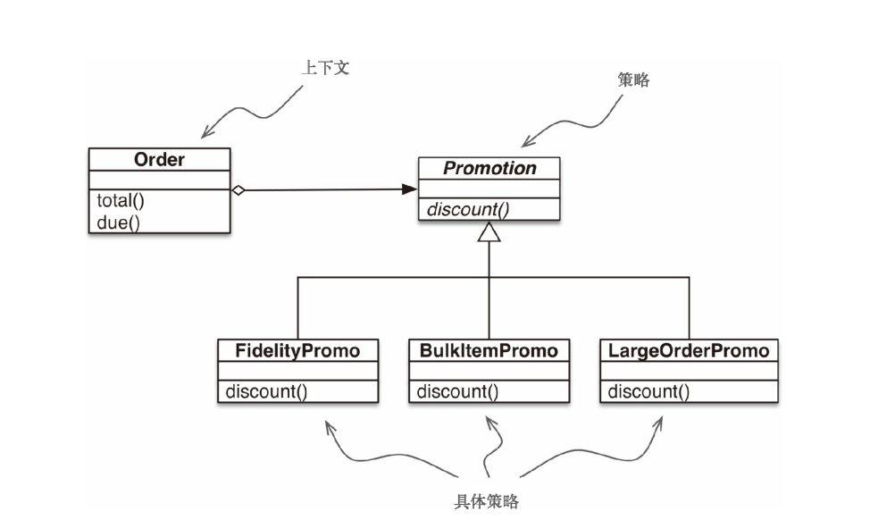
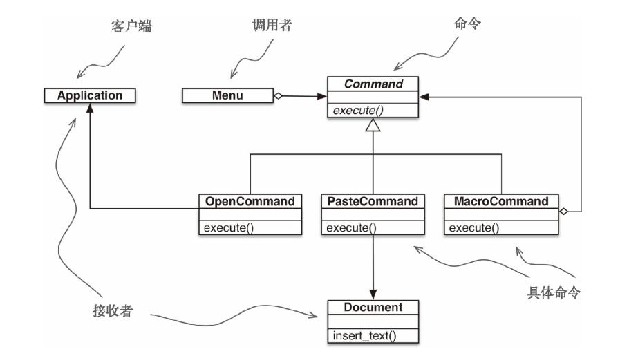

# find_beauty
朝花夕拾，记录一些比较精妙的代码

### 1. 获取类变量列表
### 2. yield用法
    2.1 通过reverse()实现反向迭代
    2.2 通过yield实现遍历树形结构
    2.3 大量文件处理，遍历行返回目标行
### 3. getattr动态执行方法 玩花活
### 4. cookie处理
### 5. 使用装饰器临时修改对象属性
### 6. 设计模型
    6.1 策略设计模型-最优购物折扣  
  
    6.2 命令设计模型-各个实例都在内部存储着命令列表  
  
### 7. 防御可变参数
    避免使用可变参数时，修改其他指向同一地址的其他参数